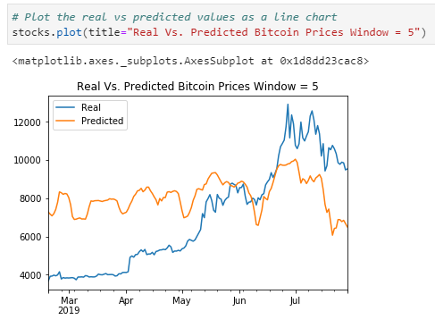
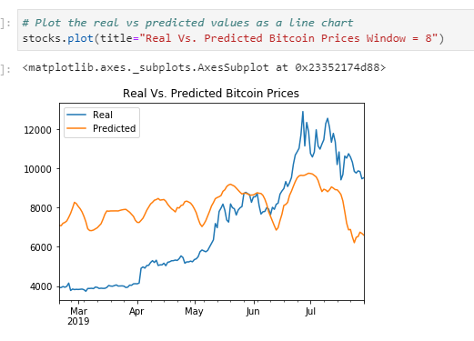
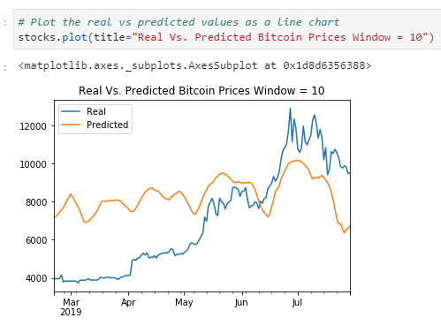
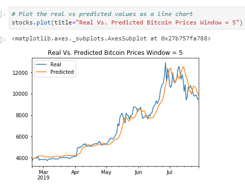
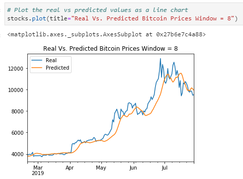
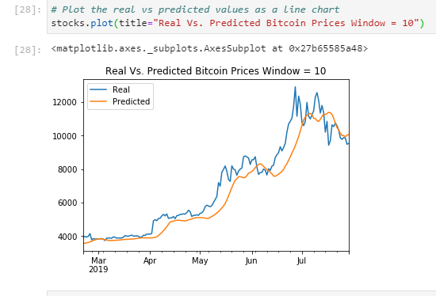

# Unit_14_Homework
Used LSTM Recurrent Neural Network models to evaluate the accuracy of predictions using sentiment analysis vs closing prices of bitcoin. 

Both evaluations are idential to ensure the only difference between the models is the data. 

## Data Gathered
Used csv files. One of historic closing prices and the other of the Crypto Fear and Greed Index (FNG) 

Performed analysis with 3 different window sizes - 10, 8, 5 on each model, with 70% split on train vs testing data. 

## Final Questions:
1. Which model has a lower loss?  
The closing price model has a lower loss, when you compare initial value to the final value. However, the FNG model ended up just about where it started. The FNG showed flat predicted earnings and the closing price model showed an overall increase in earnings. 

2. Which model tracks the actual values better over time?
The closing price model tracks better over time, as it most acurately follows the previous prices. The FNG model is particularly inaccurate at the beginning of the evaluation, as during this time sentiment was likely high, as would be for a new product that people are excited about. 

3. Which window size works best for the model?
Here are the plots using the three different window sizes:
### FNG Graphs
 

### Closing Price Graphs

In the actual closing prices model, the 5 window is closest, but it appears that there may be over-fitting in this model. The size 8 appears to be the best. For the FNG model, they are all fairly off, but the size 8 window again seems like the best option. 
